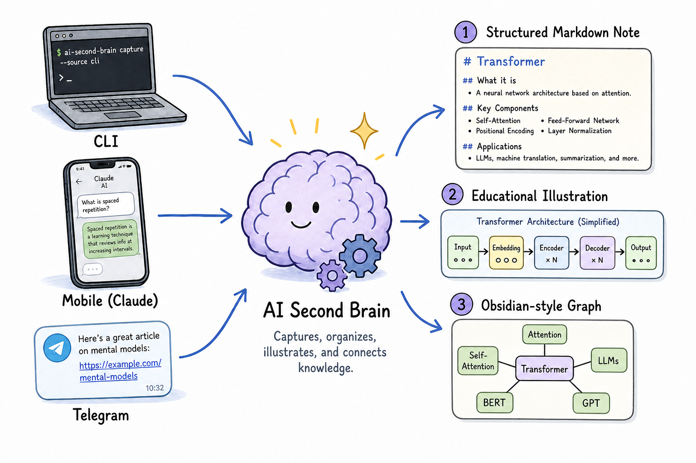

# AI Second Brain

> Capture. Understand. Visualize. Remember.

[English](README.md) · **日本語**

[](https://github.com/ttk1010/ai-second-brain/actions/workflows/ci.yml)
[](LICENSE)
[](https://www.python.org/)

<p align="center">
  
</p>

## AI Second Brain とは

AI Second Brain は、学んだことを **構造化され、図解され、育っていく知識ベース** に
変えるツールです。概念（`LLM`）・記事のURL・比較（`GPT, Claude, Gemini`）を渡すと、
[Obsidian](https://obsidian.md/) の Vault に **イラスト付きの構造化Markdownノート** を
生成し、既存のノートとつなげて知識グラフを育てます。AI を主な題材にしていますが、
生物・経済・料理などあらゆる分野を扱え、ノートごとに分野（ドメイン）を自動でタグ付けします。

本当の成果物はノートや画像そのものではなく、**整理された、使いまわせる知識** です。
すべての出力は唯一の正本である [Knowledge Object](docs/DATA_MODEL.md) から生成されるため、
ノートの体裁がぶれず、AI ツールが手元になくても Vault はそのまま役に立ち続けます。

> 📖 README は日本語・英語の2言語です。設計まわりの詳しいドキュメント（`docs/`・ADR）は
> **日本語**で書かれています。

## 生成例

```bash
uv run asb "LLM"
```

を実行すると、Vault に `01 Concepts/大規模言語モデル.md` が作られます。イラストを埋め込み、
関連ノートへのリンクまで解決した、そのまま読めるノートです。

```markdown
---
title: "大規模言語モデル"
source_type: concept
tags: [Transformer, Generative AI, Foundation Model, RAG, Attention, ...]
---

# 大規模言語モデル

## Summary
大規模言語モデル（LLM）は、大量のテキストを学習して、自然言語のパターンを
予測・生成するAIモデルです。…

## Illustration
![[Images/LLM.png]]

## Key Takeaways
- 大量のテキストから言語の統計的なパターンを学び、次の語を予測する…
- 汎用性が高く、プロンプトや追加学習で幅広いタスクに対応できる…

## Related Notes
- [[AIエージェント]] — application
- [[RAG]] — application
- [[埋め込み]] — related
```

（ノートは設定した言語で生成されます。既定は日本語です。）

実際に生成されたノート（本文＋イラスト）の例は **[docs/examples/LLM.md](docs/examples/LLM.md)** で見られます。

## 動作要件

- **Python 3.12** と [uv](https://docs.astral.sh/uv/)。
- **OpenAI API キー（必須）。** ノート生成は OpenAI API（テキストは `gpt-5.4`、イラストは
  `gpt-image-2`）を呼ぶため、**ノート単位で料金がかかります**。コストの大半は画像生成です。
  同じ入力での再実行はスキップされ（再課金なし）、`--no-image` を付ければイラストを省いて
  節約できます。
- **Claude サブスクリプション ＋ [Claude Code](https://www.claude.com/product/claude-code)（任意）。**
  リンク用スキル `asb-relink` と Telegram 取り込み（Claude Code Channels）にだけ必要で、
  中心となる `asb` コマンドには不要です。

## クイックスタート

[uv](https://docs.astral.sh/uv/) と Python 3.12 が必要です（上の「動作要件」参照）。

```bash
# 1. 依存関係をインストール
uv sync --dev

# 2. 設定：vault_path を自分の Obsidian Vault に向け、API キーを設定
cp config/settings.example.toml config/settings.toml   # vault_path を編集
echo 'OPENAI_API_KEY=sk-...' > .env

# 3. ノートを生成
uv run asb "LLM"                         # 概念
uv run asb "https://ledge.ai/..."        # ニュース記事
uv run asb --compare "GPT, Claude, Gemini"   # 比較

# --guidance でトーン・対象読者・強調点を指示
uv run asb "LLM" --guidance "高校生向けに、歴史的な背景も交えて"

# 1枚ではなく、観点ごとに分けた複数ページのイラストにする
uv run asb "LLM" --pages 4      # 4ページ（観点ごと）に分ける
uv run asb "LLM" --pages auto   # 枚数はプランナーにまかせる（2〜6）
```

各ノートは教育イラスト付きで Vault に書き込まれます。同じ入力での再実行は何もしません
（作り直すなら `--overwrite`、イラストを省くなら `--no-image`）。

`--guidance "<自由記述>"` は、ノート本文**と**イラストの両方に効く指示（トーン、対象読者、
どの切り口を強調するか）で、ノートのフロントマターに記録されます。冪等性には影響せず、
`--overwrite` を付けない限り同じ入力はスキップされます（指示を変えて作り直せます）。

`--pages {N|auto}` は、1枚のイラストを **観点ごとに分けた複数ページ**（全体像→仕組み→
具体例→注意点）に変えます。全ページが同じ画風で、2枚目以降は1枚目を参照画像として描かれます。
オプトインなので、付けなければ従来どおり1枚です。**各ページは別々の画像生成なので `--pages N`
は画像コストが N 倍**（上限6ページ）。`--no-image` が最優先で、その場合は何も生成しません。

### 既存ノートを部分的に手直しする

ノート全体を作り直さず、一部だけ直せます。

```bash
asb-revise "LLM" "要約をもっとやさしく"                # 本文の一部を書き直す
asb-revise "LLM" "図を白背景で描き直して" --illustration   # イラストを描き直す
asb-revise "LLM" "背景の説明を厚く" --section background   # セクションを指定
```

`asb-revise` はタイトルやファイル名からノートを探し、指定した本文セクション
（`summary` / `background` / `key_takeaways`）だけを書き直すか、既存の画像を参照して
イラストを描き直します（画風はそのまま、頼んだ箇所だけ変わります）。`--section` /
`--illustration` を付けなければ、指示文から対象を推測します。変更はその場で書き込まれ、
Vault は Git 管理なので、履歴はそちらに残ります。

## 主な機能

- **3つの知識タイプ：** AI **概念**、**ニュースURL**（取得して要約。JavaScript描画のサイトも対応）、**比較**（表付き）。
- **教育イラスト：** ノートごとに一貫した手描き調のイラスト（gpt-image-2）。`--pages` で複数ページにも分けられます。
- **構造化Markdownノート：** 要約・背景・要点・関連ノート・出典・タグ。AIツールなしでも読めます。
- **自然言語での手直し：** `asb-revise` で、既存ノートの一部やイラストをその場で改善できます。
- **自動リンク：** `asb-relink`（Claude Code スキル）がノート同士をつないでグラフにします（OpenAI 料金ゼロ）。バックリンクは Obsidian が担います。
- **どこからでも取り込み：** 手元の `00 Inbox` キュー（`asb-inbox`）と、Claude Code Channels（Telegram）経由のチャット取り込み。ローカル完結で、固定の運用費はかかりません。
- **外出先からの即時生成（任意）：** AWS Lambda のエンドポイントがクラウドで同じ処理を実行し、ノートを Git 管理の Vault にコミットします。Mac が起動していなくてもスマホから生成できます（インフラ費はほぼ無料・使わないときはゼロ）。手順は [DEPLOY_SERVERLESS.md](docs/DEPLOY_SERVERLESS.md)。
- **月次ダイジェスト：** `asb-digest` が [ledge.ai](https://ledge.ai/) の直近30日アクセスランキングを、1枚のノートと俯瞰イラストにまとめます。

## 仕組み

```
URL / 概念 / 比較
        │
        ▼
  入力の分類 ──▶ 抽出（LLM）
        │
        ▼
  Knowledge Object  ← 唯一の正本
        │
        ▼
  教育プランナー
        │
        ├──▶ Markdown 生成
        ├──▶ イラスト生成（gpt-image-2）
        └──▶ ノートのリンク付け
        │
        ▼
   Obsidian Vault（リポジトリ外）
```

すべてが Knowledge Object を経由するので、新しい出力形式も同じ正本を使えます。詳しくは
[docs/ARCHITECTURE.md](docs/ARCHITECTURE.md)、[docs/DATA_MODEL.md](docs/DATA_MODEL.md)、
before/after の構成図 [docs/ARCHITECTURE_DIAGRAMS.md](docs/ARCHITECTURE_DIAGRAMS.md) を参照してください。

Obsidian Vault はこのリポジトリの**外**（`vault_path` で指定）に置きます。このリポジトリは
コードとドキュメントだけを管理し、知識データそのものは一切含みません。

## ノートをつなぐ

Vault が育ってきたら、ノートをつないで知識グラフにします。

- **`asb-link`**（決定論的・無料）：Vault をインデックスし、ノートの「Related Notes」セクションだけを安全に書き換えます。
- **`asb-relink`（Claude Code スキル）**（賢い・OpenAI 料金ゼロ）：Vault 全体を読んで、どのノートがどう関連するかを判断し、リンクを適用します。OpenAI API ではなく Claude サブスクリプションを使います。

## どこからでも取り込む

取り込みと処理はキューで切り離してあり、すべて手元で動くので固定の運用費がかかりません。

Vault が Git リポジトリなら、`settings.toml` で `auto_commit = true` と `auto_push = true` を
設定すると、ローカル生成のたびにノート＋イラストが自動でコミット・プッシュされます。
ローカル生成もクラウド経路と同じく Vault リポジトリに集約され、他の端末は pull するだけになります。

- **Inbox キュー：** Obsidian から `00 Inbox/` に URL や概念のメモ（スタブ）を置き、`uv run asb-inbox` でまとめてノートにします。
- **チャット取り込み（Telegram）：** [Claude Code Channels](https://code.claude.com/docs/en/channels) 経由で bot にメッセージを送ると、手元の Claude Code が `asb` を実行して返信します。設定手順は [docs/TELEGRAM_SETUP.md](docs/TELEGRAM_SETUP.md)。
- **スマホから即時（任意）：** AWS Lambda のエンドポイントが、Mac が起動していなくてもクラウドで生成します。iOS ショートカットから起動できます。手順は [docs/DEPLOY_SERVERLESS.md](docs/DEPLOY_SERVERLESS.md)。
- **Claude のクラウドセッションから（任意）：** GitHub Actions（workflow_dispatch）がランナー上で `asb` を実行し、Vault リポジトリに push します。API キーは Actions Secrets 内に留まり、セッションには渡りません。追加インフラ不要。手順は [docs/CLOUD_GENERATION.md](docs/CLOUD_GENERATION.md)。

### ログインが必要なサイト（本文の持ち込み）

`asb` が取得できないログイン背後（無料会員の壁を含む）のページは、**自分のログイン済み
ブラウザから本文テキストを持ち込みます** — Inbox スタブ、`asb --captured-from <URL>`、
または Claude in Chrome 拡張で Claude Code にページを読ませる方法です。ASB は認証情報や
クッキーを一切扱わず、渡されたテキストを要約して、source URL の下に News として保存します。
詳しい手順は [docs/CAPTURED_CONTENT.md](docs/CAPTURED_CONTENT.md)。

## 月次ダイジェスト

`asb-digest` は、その月によく読まれた AI ニュースを1枚に俯瞰します。[ledge.ai](https://ledge.ai/) の
**直近30日アクセスランキング**を読み、記事ごとに一文要約を書き、`08 Digests` にダイジェスト
ノートと俯瞰イラストを生成します。

```bash
uv run asb-digest                       # 今月・トップ10（全自動）
uv run asb-digest --month 2026-08 --top 5
```

**高品質版（Claude Code）：** `asb-digest` スキルは実際の記事本文を読んで、ラベルや要約を
自分で執筆します。キャプションの質が上がり、しかも **OpenAI のテキスト料金はゼロ**です
（課金されるのはイラストだけ）。

## 設計思想

このプロジェクトは画像ジェネレータでもノートアプリでもなく、**知識のオペレーティング
システム**です。画像・Markdown・Git は出力にすぎず、成果物は整理された知識そのものです。
指針は次のとおりです。

- **コンテンツより知識** — 投稿ではなく、使いまわせる知識をつくる。
- **創造性より一貫性** — 同じ概念は、いつも同じように説明し、同じように描く。
- **人の管理下での自動化** — 繰り返し作業は自動化し、知識の品質は人が持つ。
- **長く保守できること** — どの判断も、数年後に読んでも筋が通っていること。

全体像と長期のゴールは [docs/PROJECT_CHARTER.md](docs/PROJECT_CHARTER.md) にあります。

## ドキュメント

設計ドキュメントは日本語、README は2言語です。

| ドキュメント | 内容 |
|----------|---------|
| [docs/PROJECT_CHARTER.md](docs/PROJECT_CHARTER.md) | ビジョンと長期ゴール |
| [docs/ARCHITECTURE.md](docs/ARCHITECTURE.md) | システムアーキテクチャ |
| [docs/ARCHITECTURE_DIAGRAMS.md](docs/ARCHITECTURE_DIAGRAMS.md) | before/after の構成図 |
| [docs/DATA_MODEL.md](docs/DATA_MODEL.md) | Knowledge Object のスキーマ |
| [docs/DEPLOY_SERVERLESS.md](docs/DEPLOY_SERVERLESS.md) | サーバーレス即時生成のデプロイ手順 |
| [docs/ROADMAP.md](docs/ROADMAP.md) | 開発ロードマップ |
| [docs/CAPTURED_CONTENT.md](docs/CAPTURED_CONTENT.md) | ログイン必須記事の取り込み |
| [docs/CLOUD_GENERATION.md](docs/CLOUD_GENERATION.md) | クラウド生成（GitHub Actions + Secrets） |
| [docs/adr/](docs/adr/) | Architecture Decision Records（設計判断の記録） |
| [docs/TROUBLESHOOTING.md](docs/TROUBLESHOOTING.md) | セットアップ・実行時のトラブル対処 |
| [CLAUDE.md](CLAUDE.md) | AI 支援開発のためのエンジニアリングガイド |

## ロードマップと進捗

🚧 開発中です。**Phase 1〜4 が完了**（基盤・教育コンテンツ・知識の整理・ローカルファーストの取り込み）。
最近追加したもの：**複数ページイラスト**（`--pages`）、**自然言語での手直し**（`asb-revise`）、
**外出先からの即時生成（任意）**（スマホから生成）。次は **Phase 5 — AI リサーチアシスタント** です。
[docs/ROADMAP.md](docs/ROADMAP.md) を参照してください。

## コントリビュートについて

コントリビュートは大歓迎です。小さく・レビューしやすく・Issue 起点の変更が望ましいです。
[CONTRIBUTING.md](CONTRIBUTING.md)（英語）を参照してください。

## ライセンス

[MIT](LICENSE) © 2026 ttk1010
