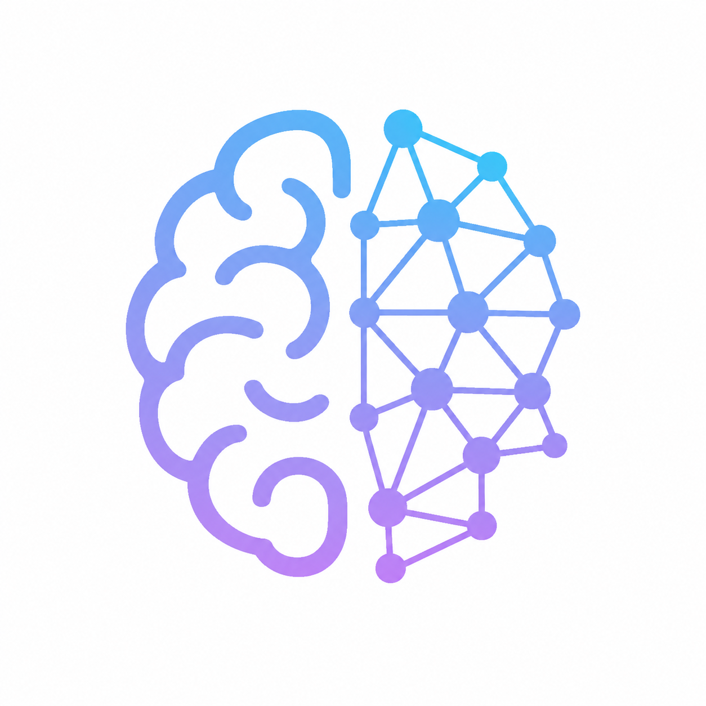
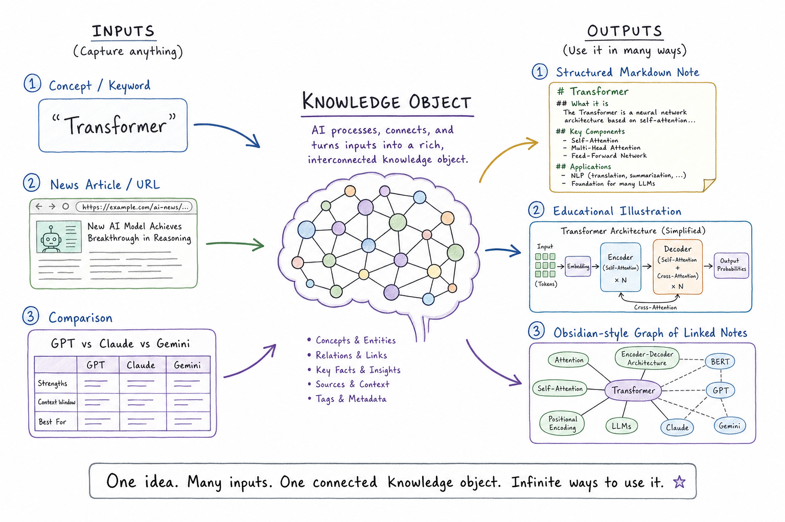

<p align="center">
  
</p>

# AI Second Brain

> Capture. Understand. Visualize. Remember.

[](https://github.com/ttk1010/ai-second-brain/actions/workflows/ci.yml)
[](LICENSE)
[](https://www.python.org/)

<p align="center">
  
</p>

## What is this?

AI Second Brain turns what you learn into a **structured, visual, and
continuously evolving knowledge base**. Give it a concept (`Transformer`), an
article URL, or a comparison (`GPT, Claude, Gemini`) — it generates a structured,
illustrated Markdown note in your [Obsidian](https://obsidian.md/) vault and
links it into your knowledge graph. AI is its default focus, but it handles any
field of knowledge (biology, economics, cooking…), tagging each note with its
domain (ADR 0008).

The real product isn't notes or images; it's **organized, reusable knowledge**.
Every output is generated from a single canonical [Knowledge
Object](docs/DATA_MODEL.md), so notes stay consistent and the vault remains
valuable even without AI tools.

## Example

```bash
uv run asb "LLM"
```

produces `01 Concepts/大規模言語モデル.md` in your vault — a full note with an
embedded illustration and resolved links:

```markdown
---
title: "大規模言語モデル"
source_type: concept
tags: [Transformer, Generative AI, Foundation Model, RAG, Attention, ...]
---

# 大規模言語モデル

## Summary
大規模言語モデル（LLM）は、大量のテキストを学習して、自然言語のパターンを
予測・生成するAIモデルです。…

## Illustration
![[Images/LLM.png]]

## Key Takeaways
- LLMは大量のテキストから言語の統計的パターンを学び、次の語を予測する…
- 高い汎用性があり、プロンプトや追加学習によって多様なタスクに適応できる…

## Related Notes
- [[AIエージェント]] — application
- [[RAG]] — application
- [[埋め込み]] — related
```

(Notes are generated in the language you configure; the default is Japanese.)

## Requirements

- **Python 3.12** and [uv](https://docs.astral.sh/uv/).
- **An OpenAI API key — required.** Generating a note calls the OpenAI API (text
  with `gpt-5.4`, illustrations with `gpt-image-2`), so it is **billable per
  note**. Image generation is the dominant cost — re-running the same input is
  skipped (no re-charge), and `--no-image` skips the illustration to save cost.
- **A Claude subscription + [Claude Code](https://www.claude.com/product/claude-code) — optional.**
  Only needed for the `asb-relink` linking skill and Telegram capture (Claude
  Code Channels); the core `asb` commands do not require it.

## Quickstart

Requires [uv](https://docs.astral.sh/uv/) and Python 3.12 (see Requirements above).

```bash
# 1. Install dependencies
uv sync --dev

# 2. Configure: point vault_path at your Obsidian vault, set your API key
cp config/settings.example.toml config/settings.toml   # then edit vault_path
echo 'OPENAI_API_KEY=sk-...' > .env

# 3. Generate a note
uv run asb "Transformer"                 # a concept
uv run asb "https://ledge.ai/..."        # a news article
uv run asb --compare "GPT, Claude, Gemini"   # a comparison

# Steer tone / audience / emphasis with --guidance
uv run asb "Transformer" --guidance "高校生向けに、歴史的背景を含めて"
```

Each note is written into your vault with an educational illustration. Re-running
the same input is a no-op (use `--overwrite` to regenerate, `--no-image` to skip
the illustration).

`--guidance "<自然文>"` adds a free-text instruction that steers the note body **and**
the illustration (tone, target audience, which angle to emphasize). It is recorded
in the note's frontmatter. Guidance does not change idempotency — the same input is
still skipped unless you pass `--overwrite` (so you can re-run with new guidance).

## Features

- **Three knowledge types:** AI **concepts**, **news URLs** (fetched &
  summarized — including JS-rendered sites), and **comparisons** (with a table).
- **Educational illustrations:** a consistent, hand-drawn visual per note
  (gpt-image-2).
- **Structured Markdown notes:** summary, background, key takeaways, related
  notes, references, tags — readable without any AI tool.
- **Automatic linking:** the `asb-relink` Claude Code skill connects notes into a
  graph at no OpenAI cost; backlinks come from Obsidian.
- **Capture from anywhere:** a local `00 Inbox` queue (`asb-inbox`) and chat
  capture via Claude Code Channels (Telegram) — local-first, no fixed hosting
  cost.

## How it works

```
URL / Concept / Comparison
        │
        ▼
  Input Classifier ──▶ Extractor (LLM)
        │
        ▼
  Knowledge Object  ← the single source of truth
        │
        ▼
 Educational Planner
        │
        ├──▶ Markdown Generator
        ├──▶ Illustration Generator (gpt-image-2)
        └──▶ Knowledge Linker
        │
        ▼
   Obsidian Vault (external)
```

Everything flows through the Knowledge Object, so new output formats consume the
same canonical representation. See [docs/ARCHITECTURE.md](docs/ARCHITECTURE.md)
and [docs/DATA_MODEL.md](docs/DATA_MODEL.md) for details.

The Obsidian vault lives **outside** this repository (configured via
`vault_path`); this repo tracks only code and docs, never knowledge data
(see [ADR 0002](docs/adr/0002-vault-and-layout.md)).

## Connecting notes

As your vault grows, connect notes into a knowledge graph:

- **`asb-link`** (deterministic, free): index the vault and safely rewrite a
  note's "Related Notes" section.
- **`asb-relink` Claude Code skill** (smart, no OpenAI cost): reads the whole
  vault, decides which notes relate (and how), and applies the links — using your
  Claude subscription, not the OpenAI API.

## Capture from anywhere

Capture is decoupled from processing by a queue, so everything runs locally with
no fixed hosting cost ([ADR 0006](docs/adr/0006-capture-interface-local-first.md)).

- **Inbox queue:** drop a stub note (a URL or concept) into `00 Inbox/` from
  Obsidian; run `uv run asb-inbox` to turn the queue into notes.
- **Chat capture (Telegram):** message a bot via
  [Claude Code Channels](https://code.claude.com/docs/en/channels); Claude Code
  on your machine runs `asb` and replies. See
  [docs/TELEGRAM_SETUP.md](docs/TELEGRAM_SETUP.md) for the step-by-step setup
  (bot token, plugin, pairing, and pre-approving commands so it runs unattended).

### Login-required sites (captured content)

For pages behind a login (incl. free-membership walls) that `asb` cannot fetch,
**bring the body text yourself** from your own logged-in browser — via an Inbox
stub, `asb --captured-from <URL>`, or Claude Code reading the page through the
Claude in Chrome extension. ASB never handles your credentials or cookies; it
just summarizes the text you give it, stored as News under the source URL
([ADR 0009](docs/adr/0009-captured-content-ingestion.md)). See
[docs/CAPTURED_CONTENT.md](docs/CAPTURED_CONTENT.md) for the step-by-step guide
(including a capture bookmarklet).

## Philosophy

This project is **not** an image generator and **not** a note-taking app — it is
a **knowledge operating system**. Images, Markdown, and Git are outputs; the
product is organized knowledge. The guiding principles:

- **Knowledge over content** — create reusable knowledge, not posts.
- **Consistency over creativity** — the same concept is always explained and
  drawn the same way.
- **Automation with human control** — the system automates the repetitive work;
  humans own knowledge quality.
- **Long-term maintainability** — every decision should still make sense years
  from now.

The full vision and long-term goals live in
[docs/PROJECT_CHARTER.md](docs/PROJECT_CHARTER.md).

## Documentation

| Document | Purpose |
|----------|---------|
| [docs/PROJECT_CHARTER.md](docs/PROJECT_CHARTER.md) | Vision and long-term goals |
| [docs/ARCHITECTURE.md](docs/ARCHITECTURE.md) | System architecture |
| [docs/DATA_MODEL.md](docs/DATA_MODEL.md) | The Knowledge Object schema |
| [docs/ROADMAP.md](docs/ROADMAP.md) | Development roadmap |
| [docs/CAPTURED_CONTENT.md](docs/CAPTURED_CONTENT.md) | Capturing login-required articles |
| [docs/adr/](docs/adr/) | Architecture Decision Records |
| [docs/TROUBLESHOOTING.md](docs/TROUBLESHOOTING.md) | Setup & runtime troubleshooting |
| [CLAUDE.md](CLAUDE.md) | Engineering guide for AI-assisted development |

## Roadmap & status

🚧 Active development. **Phases 1–4 complete** (foundation, educational content,
knowledge organization, local-first capture). **Phase 5 — AI Research Assistant**
is next. See [docs/ROADMAP.md](docs/ROADMAP.md).

## Contributing

Contributions are welcome — this project prefers small, reviewable, issue-driven
changes. See [CONTRIBUTING.md](CONTRIBUTING.md).

## License

[MIT](LICENSE) © 2026 ttk1010
