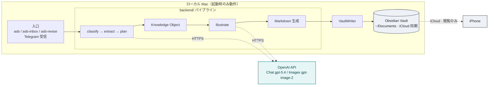
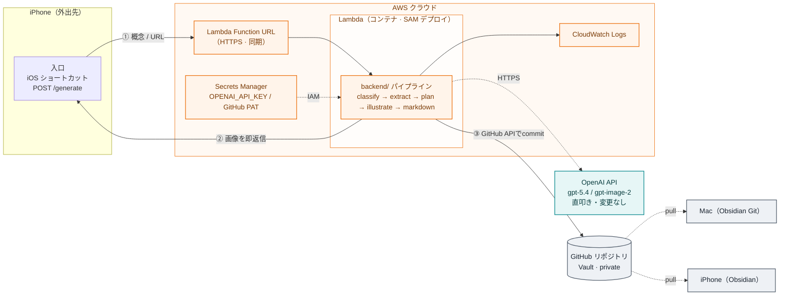

# アーキテクチャ図（Before / After）

AI Second Brain の構成を図で示す。**図1が現行（local-first）**、**図2が計画中の Phase 1（AWS Lambda によるサーバーレス化）**である。図2は提案段階で、決定は ADR 0015（Proposed）で管理する。

GitHub / Zenn はいずれも Mermaid をネイティブ描画するため、下記はそのまま図として表示・再利用できる。

## 図1：現行アーキテクチャ（local-first / ADR 0006）

入口・生成・保存がすべて手元の Mac 上にあり、Vault は iCloud で iPhone に同期される（閲覧のみ）。**Mac が起動していないと生成できない**のが制約。

## 図2：Phase 1 アーキテクチャ（serverless / 提案・ADR 0015）

外出先の iPhone から **Lambda Function URL（HTTPS）**で Lambda を直接呼び、同じ `backend/` パイプラインを実行して**画像をその場で返信**する（同期。Function URL は最大 15 分で `gpt-image-2` の数十秒生成に耐える）。生成は **OpenAI 直叩きのまま**（`gpt-image-2` の絵柄・複数参照 edit・日本語ラベルを維持）で、AWS は「常時稼働の実行＋配信」だけを担う。ノートは **GitHub API のコミット**で Mac / iPhone の Obsidian に同期する。ローカル経路（図1）も併存する。

## 変わる点 / 変わらない点

| | 内容 |
| --- | --- |
| **変わる点** | 入口が iPhone → Lambda Function URL に（Mac 起動に非依存で即時生成）／実行は Lambda（未使用時ゼロスケール、個人利用は無料枠内）／保存は GitHub API コミット |
| **変わらない点** | 生成は OpenAI 直叩き（`gpt-image-2`）／`backend/` パイプラインと Knowledge Object 設計は無改修／プロバイダ抽象は維持（将来 `BedrockImageProvider` も差し替え可能）／ローカル経路も併存 |

## 補足

- **Bedrock は今回見送り**：Bedrock の画像モデルは Nova / Stability 系のみで `gpt-image-2` が無く、検証済みの絵柄・複数参照 edit・画像内日本語を失うため。プロバイダ抽象は残すので将来の選択肢としては保持する。
- 関連：[ADR 0005](adr/0005-knowledge-organization-cost-model.md)（コストモデル）、[ADR 0006](adr/0006-capture-interface-local-first.md)（capture local-first）、ADR 0015（serverless 化・Proposed）。
