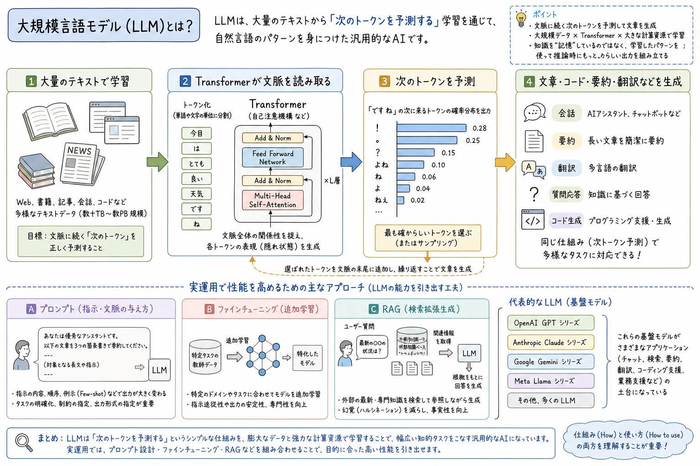

<!--
AI Second Brain が実際に生成したノートの例です（入力: `LLM`）。
Vault にはこのまま保存されます。イラストの埋め込みは Obsidian 記法
`![[Images/LLM.png]]` ですが、GitHub 上で表示できるよう、この例では標準 Markdown の
画像記法に置き換えています。`[[wikilink]]` は GitHub 上ではただのテキストとして
表示されますが、Obsidian ではノート間リンクとして機能します。
-->

---
id: a87ad7ae0515450c8c385c036acaeda0
title: "大規模言語モデル"
source_type: concept
source: "LLM"
created: 2026-06-28
language: ja
tags:
  - Transformer
  - Generative AI
  - Foundation Model
  - Prompt Engineering
  - Fine-tuning
  - RAG
  - Token
  - Attention
  - Embeddings
  - Inference
---

# 大規模言語モデル

## Summary

大規模言語モデル（LLM）は、大量のテキストを学習して、自然言語のパターンを予測・生成するAIモデルです。入力された文脈に基づいて次に続く語を推定することで、会話、要約、翻訳、コード生成など幅広いタスクに対応します。近年はTransformerアーキテクチャの発展と計算資源の増加により、高い汎用性を持つ基盤モデルとして広く使われています。

## Illustration

## Background

LLMが重要なのは、個別のタスクごとに専用モデルを作らなくても、1つのモデルで多様な言語処理をこなせるからです。ソフトウェア開発では、検索、FAQ、エージェント、コーディング支援、文書処理のような機能を短期間で実装できるようになります。一方で、もっともらしい誤りを出すことや、学習データ由来の偏り、推論コストなどの制約も理解して使う必要があります。

## Key Takeaways

- LLMは大量のテキストから言語の統計的パターンを学び、次の語を予測する仕組みを基礎に動作します。
- 高い汎用性があり、プロンプトや追加学習によって多様なタスクに適応できます。
- 中核技術としてTransformerが使われ、自己注意機構によって文脈を広く扱えます。
- 実用上は、精度だけでなく幻覚、バイアス、レイテンシ、コスト、セキュリティも重要です。
- 多くの製品では、RAG、ツール利用、ファインチューニングと組み合わせて性能を補強します。

## Related Notes

- [[埋め込み]] — related
- [[RAG]] — application
- [[AIエージェント]] — application
- [[LLM比較- GPT・Claude・Gemini]] — application
- [[PHOTON]] — related
- [[GPT-5.6]] — application

## References

- https://arxiv.org/abs/1706.03762
- https://en.wikipedia.org/wiki/Large_language_model
- https://openai.com/
- https://www.anthropic.com/
- https://ai.google/

## Tags

#Transformer #Generative-AI #Foundation-Model #Prompt-Engineering #Fine-tuning #RAG #Token #Attention #Embeddings #Inference
